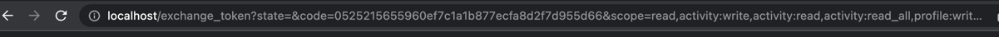
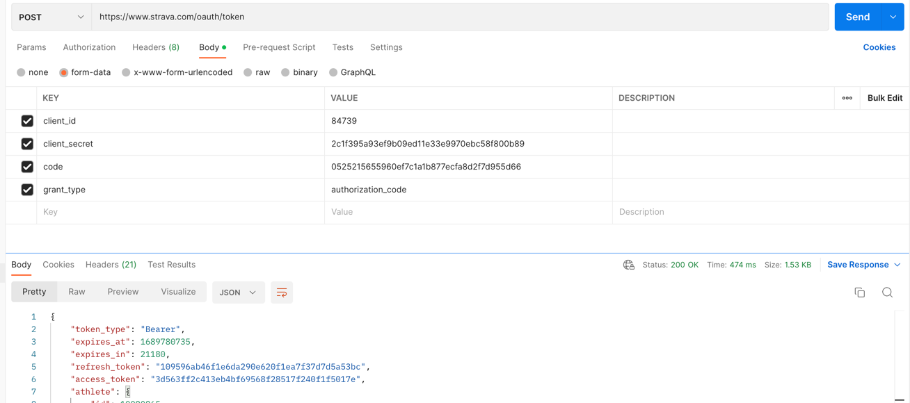
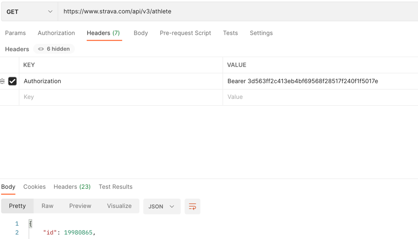
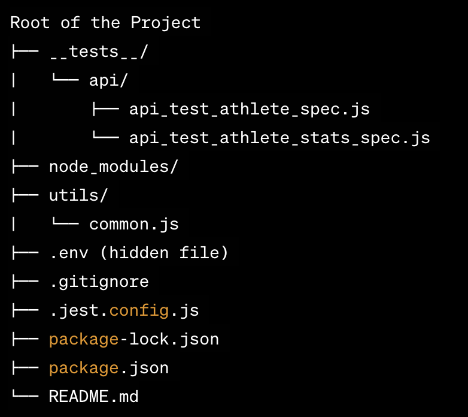

# Strava API Test Suite

This repository contains a test suite for testing the Strava API using Frisby.js. The test suite covers various scenarios to ensure that the API endpoints are working as expected.

## Prerequisites

Before running the tests, make sure you have the following installed on your system:

- Node.js (>=12.0.0)
- NPM (Node Package Manager)

## Installation

1. Clone this repository to your local machine.
2. Navigate to the project directory in your terminal.
3. Install the required dependencies by running the following command:
    > npm install


## Configuration

1. Create a `.env` file in the project root directory.
2. Set the following environment variables in the `.env` file:

```
STRAVA_USERNAME='username-string'
STRAVA_CITY='city-string'
STRAVA_CLIENT_ID='int'
STRAVA_CLIENT_SECRET='client-secret'
STRAVA_REFRESH_TOKEN='refresh-token'
STRAVA_ATHLETE_ID = 'int'
```

##### Where you can get the data to build the .env?

* ###### Username and City: https://www.strava.com/settings/profile
* ###### Client ID and Client Secret: https://www.strava.com/settings/api
* ###### Refresh Token:

    > We will need a token with scope to read and write, to get this follow this instructions:

    Access this [link](    https://www.strava.com/oauth/authorize?client_id=CLIENT_ID&response_type=code&redirect_uri=http://localhost/exchange_token&approval_prompt=force&scope=activity:write,profile:write,activity:read_all,profile:read_all,read_all,activity:read
), change the CLIENT_ID to your CLIENT_ID and reload:

    You will be redirect to this url:

    

    > Save the **code** content.

    Use the Postman to do a POST request (https://www.strava.com/oauth/token) and get your refresh token:
    > Change the values for your values and your code for the previous step
  
  

    > Save the refresh_token into the .env


* ###### Athlete ID: GET Request against https://www.strava.com/api/v3/athlete

   

  Get the ID in response and save into your .env


## Project Organization:

   

Explanation:

-   The root of the project contains various files and folders, including the test folder (`__tests__`), node modules (`node_modules`), utility functions (`utils`), configuration files (`.env` and `.jest.config.js`), and package management files (`package-lock.json` and `package.json`).
    
-   `__tests__/`: This directory contains subdirectories for different types of tests, such as API tests (`api`) and unit tests (`unit`). The `api` subdirectory includes test files related to API endpoints like `api_test_athlete_spec.js` and `api_test_athlete_stats_spec.js`. The `unit` subdirectory includes unit test files for various functions, such as `unit_test_common_spec.js` and `unit_test_other_spec.js`.
    
-   `node_modules/`: This directory contains all the installed packages and dependencies required for the project. It is generated when you run `npm install` based on the information provided in `package.json`.
    
-   `utils/`: This directory holds utility functions that are commonly used across the project. The `common.js` file is an example of such a utility module.
    
-   `.env`: This is a hidden file (usually referred to as an environment file) that stores environment-specific configuration settings, such as API keys, credentials, and other sensitive information.
    
-   `.gitignore`: This file specifies which files and directories should be ignored by Git version control, so they won't be tracked or uploaded to the repository.
    
-   `.jest.config.js`: This is the configuration file for Jest, a popular testing framework. It defines various settings and options for running tests.
    
-   `package-lock.json`: This file is automatically generated by npm and serves as a version lock file. It ensures that all developers working on the project use the same versions of the installed packages.
    
-   `package.json`: This file contains metadata about the project, including its name, version, dependencies, scripts, and other configuration settings. It also defines the project's main entry point and various scripts for running tests, building, and more.
    
-   `README.md`: This is the README file of the project. It typically includes project documentation, instructions for running the project, and other essential information for developers and users.
    

Tree Diagram Explanation:

The tree diagram above represents the project directory structure. Each node in the tree represents a directory or file within the project. Directories are denoted with a trailing slash (/), and files are shown without a trailing slash.

The root of the project contains several subdirectories and files:

-   The `__tests__/` directory contains two subdirectories, `api` and `unit`, each holding specific test files.
-   The `node_modules/` directory is automatically created and contains installed packages and dependencies.
-   The `utils/` directory holds a utility file called `common.js`.
-   The `.env` file is a hidden file storing environment-specific configuration.
-   The `.gitignore` file specifies which files should be ignored by Git.
-   The `.jest.config.js` file configures Jest for testing.
-   The `package-lock.json` file locks the versions of installed packages.
-   The `package.json` file contains metadata and configuration for the project.
-   The `README.md` file contains project documentation in English.

This directory structure helps organize the project code and makes it easier for developers to find and manage different aspects of the project, such as tests, utility functions, configuration files, and more.


## Running the Tests

To run the test suite, use the following command:

    Run all tests: npm test
    Run specified test inside a file: jest --testNamePattern="should list athlete activities - multiple activities" __tests__/api/api_test_activities_spec.js


The test runner will execute all the test cases in the `__tests__` directory and display the results in the terminal.

## Test Cases

The test cases cover the following scenarios:

### Activities Endpoint

1. **Create Activity**

-   _Description_: Verifies that a new activity can be successfully created.
-   _Steps_:
	1. Create a new activity using the `createActivity` function.
-   _Expected Outcome_:
    -   The function should return a positive integer ID for the newly created activity.
2. **Create Activity with Future Timestamp:**

-   _Description_: Verifies that an activity cannot be created with a future timestamp.
-   _Steps_:
    1.  Generate a timestamp for 7 days in the future.
    2.  Attempt to create an activity using the `createActivity` function with the future timestamp.
-   _Expected Outcome_:
    -   The function should return `null` since the activity creation should fail.
3. **Get Activity**:

-   _Description_: Verifies that an existing activity can be retrieved.
-   _Steps_:
    1.  Create a new activity using the `createActivity` function and get its ID.
    2.  Retrieve the activity using the `makeApiRequest` function with the GET method and the activity ID.
-   _Expected Outcome_:
    -   The response should have a status code of 200 (OK).
    -   The response data should include the same activity ID as the one retrieved. 
4. **Update Activity**:

    -   _Description_: Verifies that an existing activity can be updated.
    -   _Steps_:
        1.  Create a new activity using the `createActivity` function and get its ID.
        2.  Prepare data to update the activity (e.g., name and description).
        3.  Update the activity using the `makeApiRequest` function with the PUT method and the activity ID.
    -   _Expected Outcome_:
        -   The response should have a status code of 200 (OK).
        -   The response data should include the updated fields of the activity.
0.  **Create Activity with Missing Fields**:
    
    -   _Description_: Verifies that creating an activity without required fields returns a 400 (Bad Request) status.
    -   _Steps_:
        1.  Attempt to create an activity using the `makeApiRequest` function with missing required fields (e.g., name).
    -   _Expected Outcome_:
        -   The response should have a status code of 400 (Bad Request).
0.  **Create Activity with Invalid Fields**:
    
    -   _Description_: Verifies that creating an activity with invalid data returns a 400 (Bad Request) status.
    -   _Steps_:
        1.  Prepare activity data with invalid fields (e.g., invalid type, distance, trainer, and commute).
        2.  Attempt to create an activity using the `makeApiRequest` function with the invalid data.
    -   _Expected Outcome_:
        -   The response should have a status code of 400 (Bad Request).
0.  **Create Duplicate Activity**:
    
    -   _Description_: Verifies that creating a duplicate activity returns a 409 (Conflict) status.
    -   _Steps_:
        1.  Create a new activity using the `createActivity` function.
        2.  Get the data of the original activity using the `makeApiRequest` function.
        3.  Attempt to create a new activity using the same data as the original activity.
    -   _Expected Outcome_:
        -   The response should have a status code of 409 (Conflict).
0.  **Unauthorized Access to Activities**:
    
    -   _Description_: Verifies that accessing activities without authorization returns a 401 (Unauthorized) status.
    -   _Steps_:
        1.  Attempt to access the activities endpoint without an access token.
    -   _Expected Outcome_:
        -   The response should have a status code of 401 (Unauthorized).
0.  **Unauthorized Access with Invalid Token**:
    
    -   _Description_: Verifies that accessing activities with an invalid access token returns a 401 (Unauthorized) status.
    -   _Steps_:
        1.  Attempt to access the activities endpoint with an invalid access token.
    -   _Expected Outcome_:
        -   The response should have a status code of 401 (Unauthorized).


0.  **Check Sensitive Information in Response**:
    
    -   _Description_: Verifies that the response does not include sensitive information.
    -   _Steps_:
        1.  Get the list of activities using the `makeApiRequest` function with the GET method.
    -   _Expected Outcome_:
        -   The response should not include sensitive information (e.g., access_token, refresh_token, password, email, credit_card, social_security_number, bank_account_number).
0.  **List Athlete Activities with Pagination**:
    
    -   _Description_: Verifies that athlete activities are listed with pagination.
    -   _Steps_:
        1.  Retrieve the first page of athlete activities using the `makeApiRequest` function with pagination.
        2.  Calculate the total number of pages based on the total number of activities and activities per page.
        3.  Retrieve the remaining pages of activities using the `makeApiRequest` function with pagination.
    -   _Expected Outcome_:
        -   The response should have a status code of 200 (OK).
        -   The response data should be a list of activities.
        -   The total number of activities should match the expected value.
0.  **List Athlete Activities with Filtering**:
    
    -   _Description_: Verifies that athlete activities can be filtered by timestamp.
    -   _Steps_:
        1.  Create activities with different timestamps (e.g., 7 days ago, 3 days ago, 1 day ago, and current time).
        2.  Filter activities after a specified timestamp using the `makeApiRequest` function.
        3.  Filter activities before a specific timestamp using the `makeApiRequest` function.
    -   _Expected Outcome_:
        -   The response should have a status code of 200 (OK).
        -   The filtered activities should meet the timestamp conditions.
0.  **Handle per_page Limit Correctly**:
    
    -   _Description_: Verifies that the `per_page` parameter is handled correctly.
    -   _Steps_:
        1.  Test with the maximum allowed value for `per_page`.
        2.  Test with a value exceeding the limit for `per_page`.
    -   _Expected Outcome_:
        -   For the valid `per_page`, the response should have a status code of 200 (OK).
        -   For the invalid `per_page`, the response should have a status code of 400 (Bad Request) and include error information.

### Athlete Endpoint

1.  **Retrieve Athlete Data:**
    
    -   Description: Verifies that athlete data can be retrieved.
    -   Steps:
        -   Call the `makeApiRequest` function with the `GET` method and the `athlete` endpoint.
    -   Expected Outcome:
        -   The response should have a status code of 200 (OK).
        -   The response data should include the following fields:
            -   `id`, `username`, `resource_state`, `firstname`, `lastname`, `bio`, `city`, `state`, `country`, `sex`, `premium`, `summit`, `created_at`, `updated_at`, `badge_type_id`, `weight`, `profile_medium`, `profile`, `friend`, `follower`.
        -   The data types of the fields should be as follows:
            -   `id`: number
            -   `username`: string
            -   `resource_state`: number
            -   `firstname`: string
            -   `lastname`: string
            -   `bio`: string or null
            -   `city`: string
            -   `state`: string
            -   `country`: string
            -   `sex`: string
            -   `premium`: boolean
            -   `summit`: boolean
            -   `created_at`: string
            -   `updated_at`: string
            -   `badge_type_id`: number
            -   `weight`: number
            -   `profile_medium`: string
            -   `profile`: string
            -   `friend`: string or null
            -   `follower`: string or null
2.  **Verify Specific Field Values:**
    
    -   Description: Verifies that specific fields in the athlete data have the expected values.
    -   Steps:
        -   Call the `makeApiRequest` function with the `GET` method and the `athlete` endpoint.
    -   Expected Outcome:
        -   The value of the `username` field should match the value from the `STRAVA_USERNAME` environment variable.
        -   The value of the `city` field should match the value from the `STRAVA_CITY` environment variable.
3.  **Athlete Authorization:**
    
    -   Description: Verifies that unauthorized access to athlete data returns a 401 (Unauthorized) status.
    -   Steps:
        -   Make a GET request to the `athlete` endpoint without providing an access token.
    -   Expected Outcome:
        -   The response should have a status code of 401 (Unauthorized).
4.  **Athlete Authentication with Invalid Token:**
    
    -   Description: Verifies that accessing the athlete endpoint with an invalid access token returns a 401 (Unauthorized) status.
    -   Steps:
        -   Make a GET request to the `athlete` endpoint with an invalid access token in the `Authorization` header.
    -   Expected Outcome:
        -   The response should have a status code of 401 (Unauthorized).
5.  **Athlete Security:**
    
    -   Description: Verifies that the response does not include sensitive information.
    -   Steps:
        -   Call the `makeApiRequest` function with the `GET` method and the `athlete` endpoint.
    -   Expected Outcome:
        -   The response data should not include the following sensitive fields:
            -   `access_token`, `refresh_token`, `password`, `email`, `credit_card`, `social_security_number`, `bank_account_number`.

### Athlete/stats Endpoint

1.  **Retrieve Athlete Stats:**
    
    -   Description: Verifies that athlete stats can be retrieved.
    -   Steps:
        -   Call the `makeApiRequest` function with the `GET` method and the `athletes/{athlete_id}/stats` endpoint.
    -   Expected Outcome:
        -   The response should have a status code of 200 (OK).
        -   The response data should include the following fields:
            -   `biggest_ride_distance`, `biggest_climb_elevation_gain`, `recent_ride_totals`, `recent_run_totals`, `recent_swim_totals`, `ytd_ride_totals`, `ytd_run_totals`, `ytd_swim_totals`, `all_ride_totals`, `all_run_totals`, `all_swim_totals`.
        -   The data types of the fields should be as follows:
            -   `biggest_ride_distance`: number (float)
            -   `recent_ride_totals`: object
            -   `recent_run_totals`: object
            -   `recent_swim_totals`: object
            -   `ytd_ride_totals`: object
            -   `ytd_run_totals`: object
            -   `ytd_swim_totals`: object
            -   `all_ride_totals`: object
            -   `all_run_totals`: object
            -   `all_swim_totals`: object
2.  **Verify Specific Field Values in Athlete Stats:**
    
    -   Description: Verifies that specific fields in the athlete stats have the expected values.
    -   Steps:
        -   Call the `makeApiRequest` function with the `GET` method and the `athletes/{athlete_id}/stats` endpoint.
    -   Expected Outcome:
        -   The value of the `biggest_ride_distance` field should be greater than or equal to 0.
3.  **Athlete Stats Authorization:**
    
    -   Description: Verifies that unauthorized access to athlete stats returns a 401 (Unauthorized) status.
    -   Steps:
        -   Make a GET request to the `athletes/{athlete_id}/stats` endpoint without providing an access token.
    -   Expected Outcome:
        -   The response should have a status code of 401 (Unauthorized).
4.  **Athlete Stats Authentication with Invalid Token:**
    
    -   Description: Verifies that accessing athlete stats with an invalid access token returns a 401 (Unauthorized) status.
    -   Steps:
        -   Make a GET request to the `athletes/{athlete_id}/stats` endpoint with an invalid access token in the `Authorization` header.
    -   Expected Outcome:
        -   The response should have a status code of 401 (Unauthorized).
5.  **Athlete Stats Security:**
    
    -   Description: Verifies that the response does not include sensitive information.
    -   Steps:
        -   Call the `makeApiRequest` function with the `GET` method and the `athletes/{athlete_id}/stats` endpoint.
    -   Expected Outcome:
        -   The response data should not include the following sensitive fields:
            -   `access_token`, `refresh_token`, `password`, `email`, `credit_card`, `social_security_number`, `bank_account_number`.

## Contributing

Contributions to this test suite are welcome! If you find any issues or want to add more test cases, feel free to submit a pull request.

